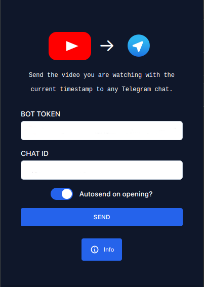

# Youtube to Telegram Extension

A Chrome extension to send any Youtube video with the current timestamp to any Telegram channel that you have ownership on.

- [Installation](#installation)
- [Usage](#usage)

## Installation

1. Run `npm i`.
2. Run `npm run build`.
3. Open `chrome://extensions/` inside your browser, click on `Load unpacked` and select the `dist` folder.

## Usage

On first launch you'll have to provide a `bot token` and a `channel id`. Please, note that the bot should have permissions of an admin in that channel. The data you'll provide will be saved to be used in future requests.
